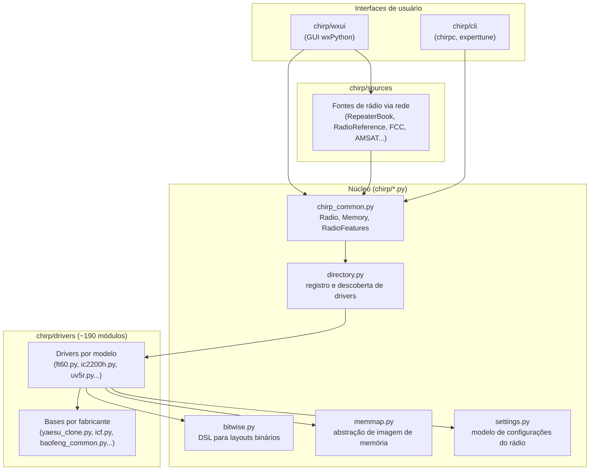
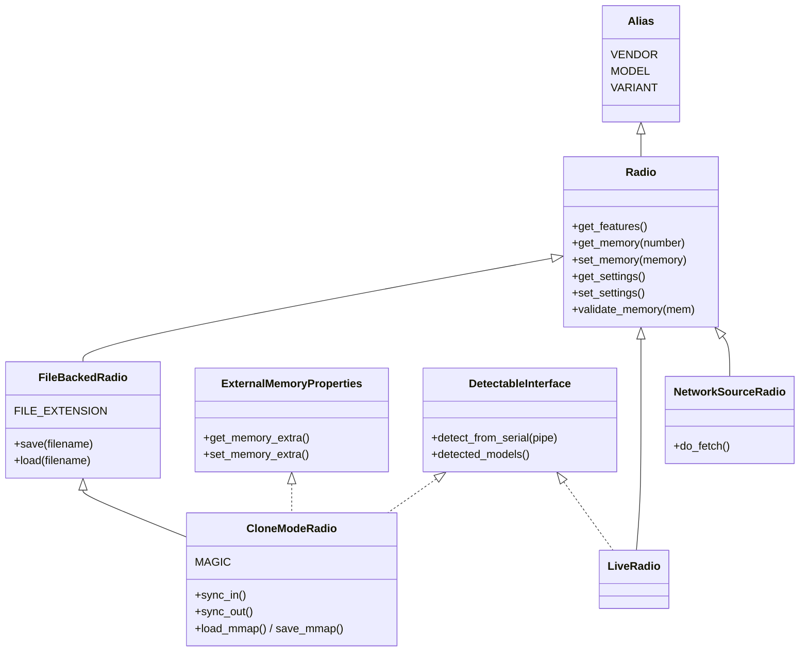
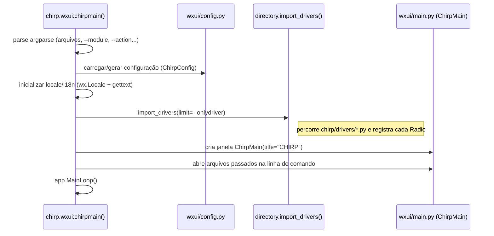
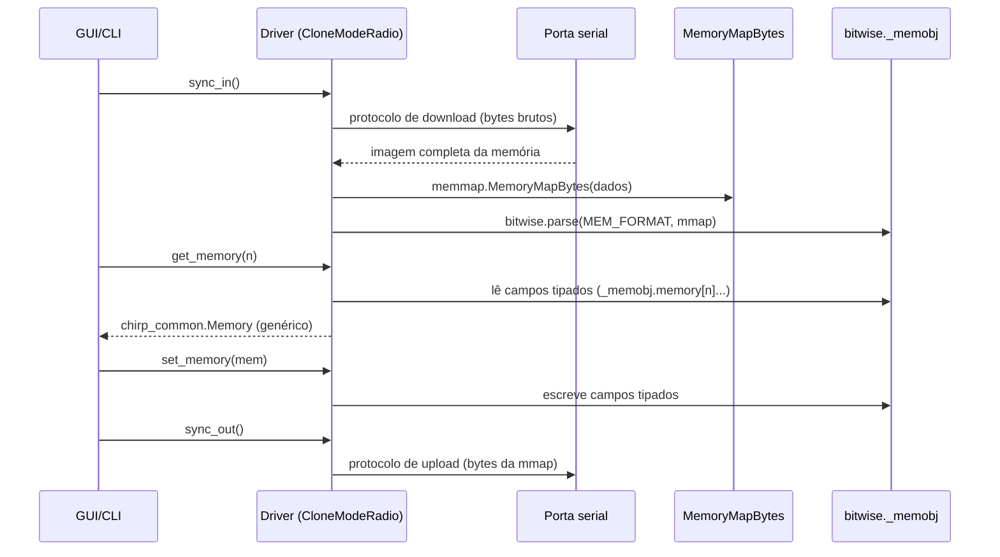
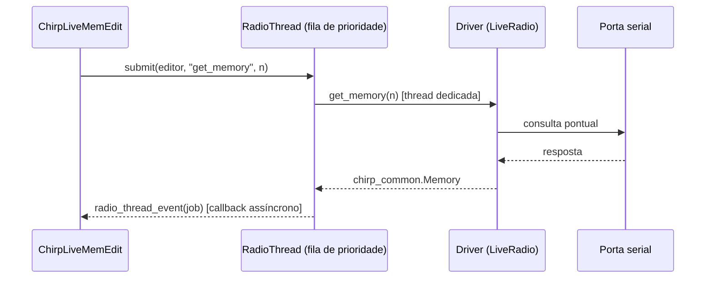
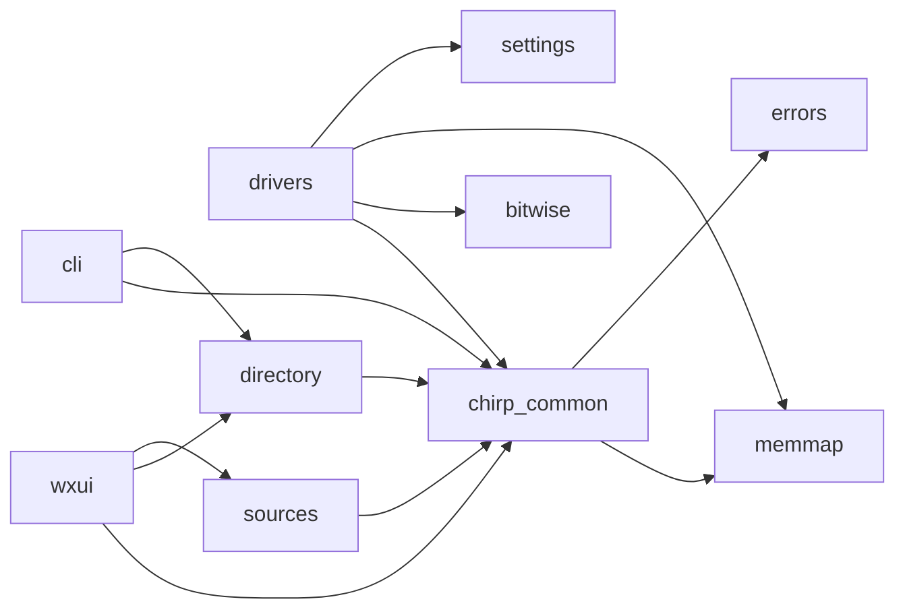

# Arquitetura do CHIRP

> Baseado no código-fonte em `https://github.com/kk7ds/chirp` (branch padrão, commit
> mais recente no momento da análise). CHIRP é uma ferramenta open-source, escrita em
> Python, para programar memórias de rádios amadores/comerciais a partir de um PC,
> suportando dezenas de fabricantes e centenas de modelos através de uma arquitetura
> de *drivers* plugáveis.

## 1. Visão geral

O projeto é organizado como um único pacote Python (`chirp/`) que separa claramente
três preocupações:

1. **Um modelo de domínio comum** (`chirp_common.py` + módulos de apoio) que
   representa o que é um "rádio", uma "memória" e suas configurações, independente
   de fabricante.
2. **Uma camada de drivers** (`chirp/drivers/*.py`), com um módulo por família de
   rádio, que traduz o modelo comum para o protocolo/formato binário específico de
   cada equipamento.
3. **Múltiplas interfaces de usuário** (GUI wxPython, CLI) que operam **apenas**
   sobre o modelo comum, nunca conhecendo detalhes de um rádio específico.

Esse desenho é o que permite adicionar suporte a um novo rádio sem tocar na UI, e
evoluir a UI sem tocar nos drivers — a costura entre as duas camadas é a classe
`Radio` e o registro dinâmico em `directory.py`.



## 2. Estrutura de diretórios (nível superior)

```
chirp/
├── chirp_common.py     # Modelo de domínio: Radio, Memory, RadioFeatures, Bank...
├── bitwise.py           # Linguagem de definição de structs binários + parser
├── bitwise_grammar.py   # Gramática auxiliar usada pelo bitwise
├── pyPEG.py             # Parser PEG vendorizado, usado pelo bitwise
├── memmap.py            # MemoryMap/MemoryMapBytes: imagem crua de memória do rádio
├── directory.py         # Registro (@directory.register) e descoberta de drivers
├── settings.py          # RadioSetting/RadioSettingGroup: menus de config do rádio
├── errors.py            # Hierarquia de exceções do domínio
├── bandplan*.py         # Dados estáticos de planos de banda (IARU, NA, AU...)
├── kenwood_tone.py      # Utilitário específico de tons Kenwood, reusado por drivers
├── import_logic.py      # Regras para importar memórias entre rádios diferentes
├── checksum.py, util.py, platform.py, logger.py   # Utilidades diversas
├── drivers/              # ~190 módulos, um por família/modelo de rádio
├── sources/              # Integrações com bases de repetidoras via rede
├── cli/                  # Interface de linha de comando (chirpc, experttune)
├── wxui/                 # Interface gráfica (wxPython)
├── stock_configs/        # Configurações de fábrica incluídas no pacote
├── share/                # Ícones, .desktop, recursos estáticos
└── locale/               # Arquivos de tradução (i18n)
```

Fora do pacote `chirp/`, o repositório expõe *wrappers* finos como pontos de
entrada: `chirpwx.py` e `chirpc` na raiz, além dos `entry_points` declarados em
`setup.py`:

```python
entry_points={
    'console_scripts': [
        "chirp=chirp.wxui:chirpmain",
        "chirpc=chirp.cli.main:main",
        "experttune=chirp.cli.experttune:main",
    ],
}
```

## 3. Núcleo do domínio (`chirp_common.py`)

Este é o módulo mais importante do projeto — praticamente tudo depende dele.

### 3.1 `Memory`
Representa um canal de memória do rádio de forma **agnóstica de fabricante**:
frequência, deslocamento de duplex, tom/DTCS, modo, nome, etiquetas de skip,
lista de campos imutáveis (`immutable`), etc. `DVMemory` estende `Memory` para
campos específicos de D-STAR (URCALL/RPTCALL/MYCALL).

### 3.2 `RadioFeatures`
Um objeto de "capacidades" que cada driver preenche (faixas de frequência
válidas, passos de sintonia suportados, se tem sub-bandas, se suporta bancos,
comprimento máximo de nome, charset válido, etc.). A UI e o `import_logic.py`
consultam `RadioFeatures` para saber o que é permitido antes de tentar gravar
uma memória, e `Radio.validate_memory()`/`RadioFeatures.validate_memory()`
devolvem `ValidationWarning`/`ValidationError` quando um valor não é
totalmente compatível.

### 3.3 Hierarquia de classes `Radio`



Três "modos" de rádio coexistem sob a mesma interface `Radio`:

- **`CloneModeRadio`**: a maioria dos HTs/móveis. O programa faz um dump
  completo da memória do rádio (`sync_in`), guarda como uma imagem binária em
  disco (`.img`, com um cabeçalho `MAGIC` + metadados em base64/JSON),
  manipula essa imagem em memória e depois regrava tudo de uma vez
  (`sync_out`). `ExternalMemoryProperties` é um *mixin* para dados que não
  cabem na imagem do rádio (ex.: comentário por canal, guardado nos metadados
  do arquivo).
- **`LiveRadio`**: rádios (tipicamente Icom "live-mode" ou D-STAR) que são
  consultados memória a memória em tempo real via serial, sem dump completo.
- **`NetworkSourceRadio`**: não é um rádio físico — representa uma fonte de
  dados via rede (ex.: RepeaterBook), reaproveitando toda a UI de edição de
  memórias para navegar/importar repetidoras.

`DetectableInterface` fornece o protocolo de auto-detecção: um driver "gerente"
(ex. um chip/família comum a várias marcas de rádio) pode declarar submodelos
via `@directory.detected_by(...)`, e `detect_from_serial()` decide em runtime
qual subclasse instanciar a partir da resposta do rádio.

### 3.4 Bancos (`Bank`, `BankModel`, `MappingModel`)
Abstraem o conceito de "bancos de memória" (agrupamentos nomeados de canais),
com variações (`StaticBankModel`, `MTOBankModel`) para os diferentes esquemas
usados pelos fabricantes.

### 3.5 `RadioPrompts`, `Status`, `errors.py`
`RadioPrompts` fornece textos de ajuda contextual por rádio; `Status` é o
objeto usado para reportar progresso de clone à UI; `errors.py` define a
hierarquia de exceções (`RadioError`, `RadioNoResponse`, `ImageDetectFailed`,
etc.) usada em toda a base de código para sinalizar falhas de forma
padronizada.

## 4. Suporte de baixo nível: `bitwise.py` e `memmap.py`

Grande parte do "trabalho pesado" de cada driver é converter bytes crus em
campos nomeados. O CHIRP resolve isso com uma **DSL própria, inspirada em C**,
interpretada por `bitwise.py` (com o parser PEG em `pyPEG.py` /
`bitwise_grammar.py`):

```c
struct {
  ul16 rxfreq;
  ul16 txfreq;
  u8   power:2,
       unknown:6;
  char name[6];
} memory[128];
```

Cada driver define uma string `MEM_FORMAT` nesse formato e chama
`bitwise.parse(MEM_FORMAT, mmap)`, obtendo um objeto (`self._memobj`) cujos
atributos podem ser lidos/escritos diretamente e refletem os bytes reais —
eliminando a necessidade de código manual de *pack/unpack*.

`memmap.py` fornece `MemoryMapBytes` (e a variante legada `MemoryMap`), uma
abstração de array de bytes com `get()`/`set()`/`get_packed()` sobre a qual o
`bitwise` opera, e que é o que efetivamente é salvo/carregado como arquivo
`.img`.

## 5. `directory.py`: registro e descoberta de drivers

Não existe um "índice" centralizado de rádios suportados escrito à mão. Em vez
disso:

- Cada driver se registra com o decorator `@directory.register` na definição
  da classe, chaveado por `VENDOR_MODEL[_VARIANT]`.
- `directory.import_drivers()` varre `chirp/drivers/*.py` com `glob` e importa
  cada módulo (o *side effect* da importação é o registro). É chamado uma
  única vez, no bootstrap da GUI e do CLI.
- `get_radio_by_image()` implementa a detecção de formato de arquivo: primeiro
  tenta casar pelos metadados JSON embutidos no arquivo (vendor/model/variant),
  e cai para `rclass.match_model(filedata, filename)` (tipicamente comparação
  de tamanho de imagem) em arquivos antigos sem metadados.
- `detected_by()`/`detect_model()` implementam a auto-detecção em tempo real
  via serial para famílias de rádios que compartilham o mesmo cabo/protocolo
  mas se diferenciam por uma resposta do firmware.

Esse mecanismo é o que torna a arquitetura **plugável**: adicionar um novo
rádio é, em princípio, criar um novo arquivo em `chirp/drivers/`, sem alterar
nenhum outro módulo do núcleo ou da UI.

## 6. Camada de drivers (`chirp/drivers/`)

~190 módulos, cada um tipicamente responsável por um modelo ou uma pequena
família de modelos. Padrões recorrentes:

- **Bases por fabricante**: módulos como `yaesu_clone.py` (protocolo de clone
  Yaesu + checksum), `icf.py` (protocolo Icom, incluindo variantes clone e
  live), `baofeng_common.py` (protocolo comum a rádios baseados em chips
  populares chineses) concentram o protocolo serial e utilidades de
  checksum/bank comuns a dezenas de modelos. Drivers de modelo específico
  herdam dessas bases (ex.: `FT60Radio(yaesu_clone.YaesuCloneModeRadio)`).
- **Drivers de modelo** (`ft60.py`, `ic2200h.py`, etc.) tipicamente contêm:
  1. Funções de baixo nível de I/O serial (`_download`/`_upload`, envio de
     ACK, etc.), quando não herdadas da base do fabricante;
  2. A string `MEM_FORMAT` (DSL do `bitwise`) descrevendo o layout binário;
  3. A classe `Radio` propriamente dita, decorada com `@directory.register`,
     implementando `sync_in`/`sync_out`, `get_memory`/`set_memory` (traduzindo
     entre `self._memobj` — a visão tipada do `bitwise` — e um `chirp_common.Memory`
     genérico) e `get_features()`.
- **`generic_csv.py`** implementa um "rádio" que na verdade é um arquivo CSV
  (`CSVRadio`, e variantes como `CommanderCSVRadio`), reaproveitando toda a UI
  de edição para importar/exportar planilhas de memórias sem hardware algum.
- **`fake.py`**: rádios simulados registrados apenas em modo desenvolvedor,
  úteis para testar a UI sem hardware físico.

## 7. Fontes externas (`chirp/sources/`)

Módulos como `repeaterbook.py`, `radioreference.py`, `dmrmarc.py`,
`amsats.py`, `fips.py` (dados da FCC), `przemienniki_*.py` (bases polonesas)
implementam `NetworkSourceRadio`/consultas HTTP para baixar listas de
repetidoras de serviços públicos e apresentá-las como memórias importáveis —
reutilizando o mesmo grid de edição e a mesma lógica de importação (
`import_logic.py`) usada para rádios físicos.

## 8. Interfaces de usuário

### 8.1 CLI (`chirp/cli/`)

- `main.py` é o ponto de entrada do executável `chirpc`: um utilitário
  não-interativo que chama `directory.import_drivers()`, instancia o driver
  apropriado (a partir de um arquivo de imagem ou porta serial) e expõe
  operações (`get`/`set` de memória, listar rádios suportados, etc.) via
  `argparse`, operando exclusivamente sobre a API de `chirp_common.Radio`.
- `experttune.py` é uma ferramenta CLI especializada, construída sobre a mesma
  base.

### 8.2 GUI (`chirp/wxui/`) — wxPython

Fluxo de bootstrap (`chirp.wxui:chirpmain`, chamado pelo entry point `chirp`):



Principais módulos e responsabilidades:

| Módulo | Responsabilidade |
|---|---|
| `wxui/__init__.py` | `chirpmain()`: parsing de argumentos, i18n, config, chamada a `directory.import_drivers()`, criação da janela principal, loop de eventos wx |
| `wxui/main.py` | `ChirpMain` (frame/janela principal, menus, gerência de abas), `ChirpEditorSet` (uma aba = um arquivo/rádio aberto, contendo os sub-editores), `ChirpWelcomePanel` |
| `wxui/common.py` | `ChirpEditor` (classe-base de todo painel de edição), mixins `ChirpSyncEditor`/`ChirpAsyncEditor`, `LiveAdapter` (faz um `LiveRadio` parecer um `CSVRadio` para reaproveitar a UI de edição em lote), decorator `error_proof` para tratamento uniforme de exceções |
| `wxui/memedit.py` | `ChirpMemEdit`: grid de edição de memórias (a tela principal), com uma classe de coluna por tipo de campo (`ChirpFrequencyColumn`, `ChirpToneColumn`, `ChirpDTCSColumn`...); `ChirpLiveMemEdit` para rádios live |
| `wxui/bankedit.py` | `ChirpBankEdit`: grid de atribuição de canais a bancos |
| `wxui/settingsedit.py` | Renderiza a árvore `RadioSettingGroup`/`RadioSetting` (de `settings.py`) retornada por `Radio.get_settings()` como formulário editável |
| `wxui/clone.py` | `CloneThread`/`SettingsThread`: threads de background que chamam `sync_in`/`sync_out` do driver e reportam progresso (via `chirp_common.Status`) a uma barra de progresso na UI |
| `wxui/radiothread.py` | `RadioThread`: fila de prioridade (produtor/consumidor) que serializa chamadas a um `LiveRadio` em uma thread dedicada, mantendo a UI responsiva durante I/O serial |
| `wxui/query_sources.py` | Diálogos que usam `chirp/sources/*` para consultar/baixar repetidoras externas |
| `wxui/developer.py`, `memquery.py`, `radioinfo.py` | Ferramentas de desenvolvedor (inspeção de memória bruta, diffs, info do rádio) habilitadas via modo desenvolvedor |
| `wxui/config.py` | Leitura/escrita do arquivo de configuração do usuário (`ChirpConfig`) |
| `wxui/bugreport.py`, `report.py` | Coleta de ambiente e relatório de bugs, checagem de atualizações |

O padrão geral da GUI é: **um `ChirpEditorSet` por arquivo/rádio aberto**,
contendo abas internas (`ChirpEditor` subclasses) para memórias, bancos e
configurações — todas operando sobre a mesma instância de `Radio` obtida via
`directory`/`get_radio_by_image()`, nunca conhecendo o driver concreto por
trás da interface.

## 9. Fluxos de dados principais

### 9.1 Modo *clone* (a maioria dos rádios)



### 9.2 Modo *live* (consulta memória a memória via serial)



### 9.3 Persistência em arquivo

`CloneModeRadio.save()`/`load()` (via `save_mmap`/`load_mmap`) gravam a
`MemoryMapBytes` crua em um arquivo `.img`, anexando um cabeçalho `MAGIC` +
um blob JSON (base64) com metadados (`vendor`, `model`, `variant`,
`chirp_version`, mais dados extras como comentários por canal, quando o rádio
não os suporta nativamente). Esse metadado é o que permite que
`get_radio_by_image()` reidentifique corretamente o driver certo ao reabrir
o arquivo, mesmo entre modelos com imagens de mesmo tamanho.

## 10. Testes (`tests/`)

- `tests/base.py` fornece uma bateria de testes genéricos (`TestCase`) aplicada
  a **todos** os drivers registrados — cada arquivo `.py` em `chirp/drivers`
  ganha testes automáticos de leitura/escrita de memória, validação de
  `RadioFeatures`, round-trip de clone, etc. (`test_drivers.py`,
  `test_brute_force.py`, `test_edges.py`, `test_banks.py`, `test_settings.py`).
- `icom_clone_simulator.py` simula o lado "rádio" do protocolo serial Icom
  para permitir testar o fluxo de clone sem hardware.
- `driver_xfails.yaml`/`xfails.txt` documentam falhas conhecidas/aceitas por
  driver, permitindo rodar a suíte completa mesmo com drivers incompletos.

## 11. Empacotamento e distribuição

`setup.py` empacota tudo sob o nome `chirp`, com `wxPython` como dependência
opcional (`extras_require={'wx': [...]}`) — ou seja, o **núcleo + CLI** podem
ser usados sem GUI instalada. Além do `pip`/`setuptools`, o repositório inclui
receitas de empacotamento para Flatpak (`flathub/`), Snap (`snap/`) e Nix
(`flake.nix`), todas apenas invocando os mesmos entry points.

## 12. Como estender (pontos de extensão)

| Objetivo | Onde tocar |
|---|---|
| Suportar um novo modelo de rádio | Novo módulo em `chirp/drivers/`, subclasse de `CloneModeRadio`/`LiveRadio` (ou de uma base de fabricante existente), decorado com `@directory.register` |
| Suportar uma nova fonte de repetidores via rede | Novo módulo em `chirp/sources/`, subclasse de `NetworkSourceRadio` |
| Adicionar um novo tipo de campo editável na grid | Nova subclasse de `ChirpMemoryColumn` em `wxui/memedit.py` |
| Adicionar uma nova regra de importação entre rádios | `import_logic.py` |
| Novo formato de arquivo auxiliar (além de `.img`/CSV) | `directory.register_format()` + implementação em `FileBackedRadio` |

## 13. Resumo das dependências entre camadas



A regra geral do projeto é: **as dependências apontam para dentro** —
`drivers/`, `sources/`, `cli/` e `wxui/` dependem de `chirp_common.py`, mas
`chirp_common.py` nunca importa nada de `drivers/`, `wxui/` ou `cli/`. Isso é
o que garante que o núcleo permaneça estável enquanto centenas de drivers e
duas interfaces de usuário evoluem de forma independente.

## Apêndice A — Estudo de caso: o ecossistema de rebrands Retevis

A Retevis é, na prática, uma revendedora que reembala hardware de várias
origens — não existe um único "protocolo Retevis". Uma varredura por
`VENDOR = "Retevis"` em `chirp/drivers/` encontra **~95 declarações de
modelo espalhadas por 20 arquivos**, organizadas em quatro categorias.

### A.1 Puro rebrand (mesmo firmware, apenas nome trocado)

Sem classe própria — apenas um `Alias` usado para reconhecer o arquivo
`.img`/metadados salvos, e listado em `ALIASES` do driver "dono":

```python
class RT5RAlias(chirp_common.Alias):
    VENDOR = "Retevis"
    MODEL = "RT5R"
```

Exemplo: `RT5`, `RT5R`, `RT5RV`, `RT5(tri-power)` em `uv5r.py` — são o
**Baofeng UV-5R** sem nenhuma diferença de protocolo.

### A.2 Rebrand de driver de outro fabricante (classe própria, base alheia)

Classe registrada, mas herdando de um driver cujo "dono" é outra marca —
geralmente só ajustando faixa de frequência/nome:

| Modelo Retevis | Herda de | Arquivo | Fabricante original |
|---|---|---|---|
| RT6 | `WP970I` | `baofeng_wp970i.py` | Baofeng WP970i |
| RT95 / RT95vox | `AnyTone778UVBase` | `anytone778uv.py` | AnyTone 778UV |
| RA79 | `UVK5Radio` | `uvk5.py` | Quansheng UV-K5 |
| RT9000D (VHF/UHF/220/66-88) | `Th9000Radio` | `th9000.py` | TYT TH9000 |
| MA1 | `TYTTH9800Base` | `th9800.py` | TYT TH9800 |
| RA89, RT85, P2, P62 | `THUV88Radio` | `th_uv88.py` | TYT TH-UV88 (RA89 é a versão GMRS) |
| RA685, RA85 | `RadioddityGA510Radio` | `ga510.py` | Radioddity GA-510 |
| RT24, RT24V, H777S | `RadioddityR2` | `radioddity_r2.py` | Radioddity R2 |
| RT16, RB27, RB27B, RB27V, RB627B | `BFT8Radio` | `bf_t8.py` | Baofeng BF-T8 |
| RA25 | própria (`RA25UVRadio`) | `retevis_ra25.py` | reaproveitada pelo `AnyTone779UV` (a via inversa!) |

### A.3 Famílias com protocolo "de casa" da Retevis

Aqui a Retevis é a marca-base do arquivo — cada um define seu próprio
`MEM_FORMAT` (DSL do `bitwise`) e handshake serial:

| Família (arquivo) | Base | Variações registradas |
|---|---|---|
| **H777** (`h777.py`) | `H777Radio` | `RetevisH777`, `H777PlusRadio` — o mesmo arquivo também registra rebrands de outras marcas (Arcshell AR-5/AR-6, Greaval GV-8S/9S, MP31, ROGA2S, BFM4, MT8S, BF1901/04/09, Maverick RA100/425) |
| **H777 V4** (`retevis_h777v4.py`) | `H777V4BaseRadio` | `H777V4`, `RT21HRadio` — firmware novo, **auto-detectado a partir do H777 clássico** via `@directory.detected_by(h777.RetevisH777)` |
| **RT21** (`retevis_rt21.py`) | `RT21Radio` | Maior família própria: `RT21V`, `RB26`/`RB626`, `RT76`, `RT29_UHF`→`RT29_VHF`, `RB23`, `RT19`→`RT619`, `RB17A`, `RT40B`, `RB28B`→`RB628B`, `RT86`→`RT86S`, `RB89` |
| **RT22** (`retevis_rt22.py`) | `RT22Radio` | `RT22FRS`, `RT622` — base reaproveitada também pela **WLN** (`KDC1`) |
| **RB15** (`retevis_rb15.py`) | `RB15RadioBase` | `RB15Radio`, `RB615RadioBase`→`RB615` |
| **RB17P** (`retevis_rb17p.py`) | `RB17P_Base` | `RB17PRadio` |
| **RB28** (`retevis_rb28.py`) | `RB28Radio` | `RB628Radio` |
| **RA87** (`retevis_ra87.py`) | `RA87StyleRadio` | `RA87Radio`, com `get_sub_devices()` retornando `RA87RadioLeft`/`RA87RadioRight` — rádio de **dois VFOs independentes** sobre a mesma imagem de memória |
| **RA86**, **RT1**, **RT23**, **RT26**, **RT76P**, **RT87**, **RT98** | `CloneModeRadio` direto | famílias isoladas de um único modelo cada |
| **C2** (`retevis_c2.py`) | `CloneModeRadio` direto | protocolo moderno: framing STX/ETX com byte-stuffing DLE, **115200 baud** |
| **HA1G/HA1UV/HA2** (`retevis_ha1g.py`, `retevis_ha2.py`) | `HA1G` | repetidoras/base GMRS, 115200 baud, com suporte a bancos nomeados (`HA1GBank`); `HA2` herda de `HA1G` |

### A.4 A "mega-família" Radtel T18 (Retevis é só um dos rebrands)

`radtel_t18.py` é o caso mais extremo: a classe-base `T18Radio` (marca
oficial "Radtel") tem **~25 variações registradas como Retevis** no mesmo
arquivo — `RT20`, `RT22S`, `RB18`→`RB618`, `RT68`→`RT668`,
`RB17`→`RB17V`/`RB617`, `RB75`, `RB85`, `RT47`→`RT47V`/`RT647`,
`RB19`/`RB19P`→`RB619`, `RB29`→`RB629`, `RB87`, `RT15`,
`H777H_FRS`/`H777H_PMR` — variando só faixa de banda, potência e nome, numa
árvore de heranças de 2–3 níveis.

### A.5 O protocolo subjacente às famílias "clássicas"

RT21, T18, H777 e a maioria das famílias da seção A.3 (exceto C2/HA1G)
seguem o mesmo esqueleto de protocolo de clone barato chinês:

```python
_magic = b"PRMZUNE"                  # handshake para entrar em modo de programação
_fingerprint = [b"P3207s\xF8\xFF"]   # assinatura do chip, validada na resposta
_upper = 16                          # nº de canais — parametriza o MEM_FORMAT
BLOCK_SIZE = 0x10
BAUD_RATE = 9600
```

- O `MEM_FORMAT` é **parametrizado** (`MEM_FORMAT % self._mem_params`), então
  uma subclasse muda só a quantidade de canais/tamanho de imagem.
- A identificação do modelo exato acontece de duas formas complementares:
  - **Ao abrir arquivo**: `match_model(filedata, filename)` compara tamanho +
    uma assinatura de bytes num offset fixo.
  - **Ao conectar via serial**: `detect_from_serial(pipe)` lê uma string de
    identificação do rádio (mais explícito no H777, com um dicionário
    `IDENT` por subclasse).
- **C2** e **HA1G/HA2** rompem esse padrão: C2 usa framing STX/ETX com
  DLE-stuffing a 115200 baud, e HA1G/HA2 também rodam a 115200 com suporte a
  bancos — hardware/firmware mais recente que os HTs de entrada.

### A.6 Alerta de nomenclatura

A Retevis reutiliza nomes de modelo entre famílias **não relacionadas**,
o que pode confundir a leitura do código:

- `RB17` (família T18) ≠ `RB17P` (família própria) ≠ `RB17A` (família RT21)
- `RB28` (família própria) ≠ `RB28B` (família RT21)
- `RT76` (família RT21) ≠ `RT76P` (arquivo próprio `retevis_rt76p.py`)

A "marca no gabinete" não é um bom indicador de protocolo — o que importa é
de qual base/arquivo o driver efetivamente herda.
